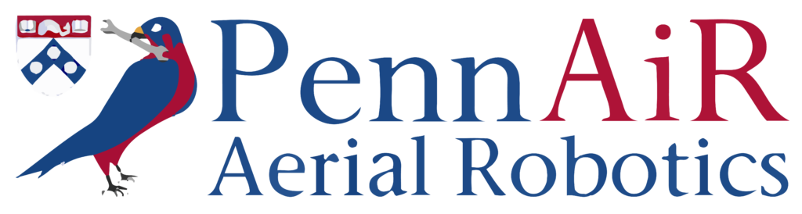

:layout: landing

PennAiR Monorepo
==================

.. rst-class:: lead

    Welcome to the Monorepo for the Penn Aerial Robotics Software Team! This repository is designed
    to centralize all code and documentation for our projects.

    Click **Get Started** or any of the Quick Links below.

.. container:: buttons

    :doc:`Get Started <installation/index>`
    `GitHub <https://github.com/pennaerial/monorepo>`_

Quick Links:
---------------

.. grid:: 1 1 2 3
    :gutter: 2
    :padding: 0

    .. grid-item-card:: Installation
        :link: installation/index
        :link-type: doc

        Installation Guide for Linux/macOS. Includes ROS 2, PX4, Gazebo Simulation, and ESP-32 toolchain for payload firmware.

.. toctree::
   :hidden:
   :maxdepth: 2
   :caption: GETTING STARTED

   Installation <installation/index>

.. toctree::
   :hidden:
   :maxdepth: 2
   :caption: SAE 2025 WORKSPACE

   Python API Reference <autoapi/index>

.. toctree::
   :hidden:
   :maxdepth: 2
   :caption: PAYLOAD CONTROLLER

   C++ API Reference <pc_api/index>

