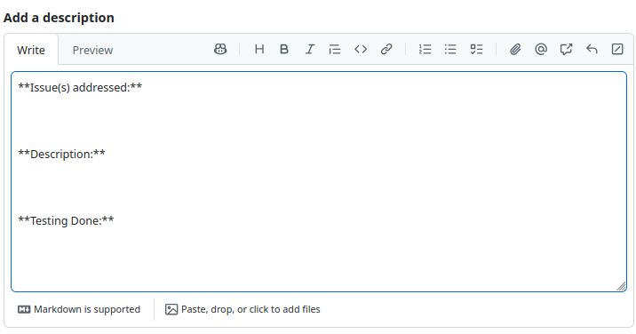
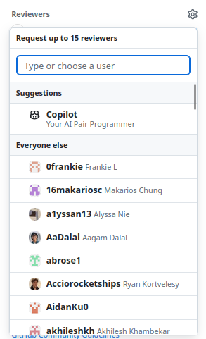
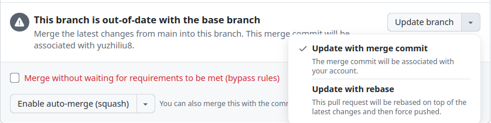
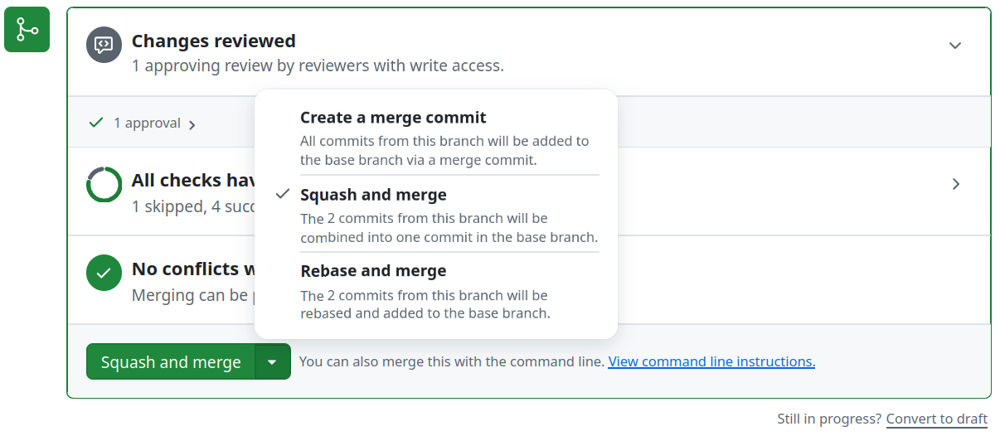

Development Guide
=================

.. rst-class:: lead

    Learn about our specific guidelines for development.
    These guidelines ensure a smooth workflow and help maintain high code quality.

----

Development Workflow
--------------------

Branching Strategy
^^^^^^^^^^^^^^^^^^

All development should be done on individual branches, not directly on the
``main`` branch.

Please follow this naming convention for branches: ``user/<username>/<branch_name>``

For example: ``user/ethayu/docs``

Creating a New Branch
^^^^^^^^^^^^^^^^^^^^^

1. **Switch to the main branch:**

   .. code-block:: bash

      git checkout main

2. **Pull the latest changes from the** ``main`` **branch:**

   .. code-block:: bash

      git pull origin main

3. **Create and switch to your new branch:**

   .. code-block:: bash

      git checkout -b user/<username>/<branch_name>

Development Practices
^^^^^^^^^^^^^^^^^^^^^

* **Commit Often:** Make small, incremental commits with clear and concise descriptions.

* **Write Quality Code:** Ensure your code is clean, well-documented, and adheres to the team's coding standards.

* **Push Regularly:** Push your changes regularly to avoid conflicts.

Submitting Changes
^^^^^^^^^^^^^^^^^^

1. **Push your branch to the remote repository:**

   .. code-block:: bash

      git push -u origin user/<username>/<branch_name>

2. **Create a Pull Request (PR):**

   * Open the GitHub repository in your browser.
   * Navigate to **Pull Requests** and click **New Pull Request**.
   * Select your desired branch and click **Create pull request**.

Fill out the PR description:

Under **Issues addressed**, link any related GitHub Issues. If there are none, delete this field.

.. note::

    To link an issue, type ``#`` followed by the issue number. If the PR fixes the
    issue, type ``Fixes #`` followed by the issue number. This will automatically
    close the linked issue when the PR is merged.

Under **Description**, provide a concise summary of your changes.

Under **Testing Done**, describe how you tested your changes. All changes should be tested;
if no testing was done, briefly explain why.

.. note::

    For simple, smaller scoped PRs, this field can be something as simple as
    *code built* or *docs built*.

Code Review
^^^^^^^^^^^

Before merging, you must get at least one other team member to **Approve** your PR.

Under **Reviewers** on the right, click the gear icon and select a reviewer.

For issue-related PRs, consider requesting the issue's author as a reviewer.

If a reviewer requests changes, address their feedback and push the changes to your branch.
Resolve comments once they have been addressed, then re-request a review.

An **Approval** means the PR is ready to merge. Any remaining changes should be minor enough that the
contributor is trusted to address them without another review.

Before merging, ensure all required CI/CD checks pass. The contributor is responsible for
merging the approved PR into ``main``.

Merging to Main
^^^^^^^^^^^^^^^

Before merging, make sure your branch is up to date with ``main``. If ``main`` has changed,
GitHub will prompt you to update your branch. Click **Update with rebase** to bring the latest
changes from ``main`` into your branch.

If GitHub cannot update the branch due to merge conflicts, resolve the conflicts before continuing.

Updating your branch may rerun CI/CD; ensure all required checks still pass.

Once your branch is up to date, approved, and passing all required checks, select
**Squash and merge** to keep ``main``'s commit history clean.

Best Practices
--------------

* **Stay Informed:** Regularly check the repository for updates and announcements.

* **Communicate:** Keep in touch with your team members about your progress and any challenges you face.

* **Document:** Update project documentation and READMEs as necessary to reflect new changes or additions.

Thank you for contributing to the Penn Aerial Robotics Team. Let's make great things happen together!
