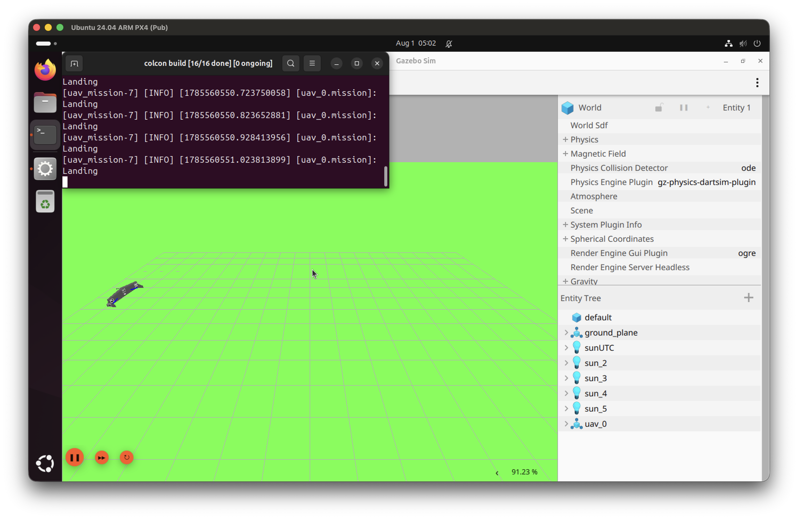

# macOS Installation

```{rst-class} lead
**Note**: the following has not been fully tested yet. Please @frankie on Slack if there are any issues with the installation or setup.
```

----

## Setting Up

0. Install UTM using brew: `brew install --cask utm`

- If you don't have Homebrew yet, install from [here](https://brew.sh/)

1. Download the UTM `.zip` from the [Google Drive](https://drive.google.com/file/d/1pJoFcWC-5QDGZMAlzlbeUv8HliJxBTGk/view?usp=drive_link)

- (make sure you have access to the **Penn Aerial Robotics Main Drive**)

2. Unzip the image in Finder. There should be a file with a `.utm` extension

- The image has the following pre-applied configurations:
  - 12 GB RAM
    - If you have 8 GB RAM, consider using 6 GB RAM, but do know that the host (MacOS) might be unusable
  - 64 GB pre-allocated disk space

3. Import the image using UTM --> File --> Open, and select the unzipped UTM image
4. Double-click the image or click on the play button to start the VM

- First boot is expected to take awhile

5. Log in to the system

## First Run

0. Install QGroundControl on the MacOS host: `brew install --cask qgroundcontrol`
1. Open a Terminal in the VM. `cd` into the `monorepo` and into `monorepo/controls/sae_2025_ws`
2. Run `colcon build`, followed by `source install/setup.bash` and `ros2 launch uav main.launch.py`

- Verify that the UAV is able to take off and land.
  

3. The VM should be ready!

## Next Steps

- Please please change the password using `passwd` and following the instructions
- Set up GitHub authentication to push to the `monorepo` (recommended: [SSH authentication](https://docs.github.com/en/authentication/connecting-to-github-with-ssh))
- Look at the [Ubuntu Installation](./ubuntu.rst) for further instructions

```{note}
The UTM image contains a frozen snapshot of the dependencies and codebase at the time it was created and uploaded to the drive. It is usually updated infrequently due to the hassle of uploading and compressing the large file to our drive, so we highly recommend to make sure the codebase and its submodules are updated and then following the **Ubuntu Installation** starting from {ref}`PX4 Installation <px4-installation>`.
```
