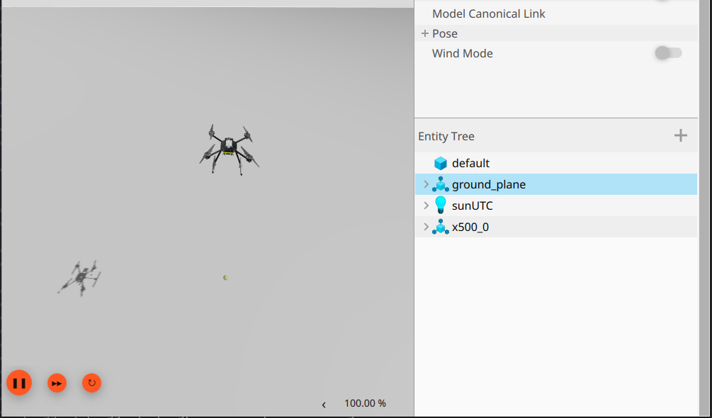

Ubuntu Installation
====================

.. rst-class:: lead

   Installation Guide for Ubuntu 24.04. Covering installing ROS 2, PX4-Autopilot, Gazebo,
   and the ESP-IDF toolchain.

----

Clone The Repository
````````````````````

.. code-block:: bash
    :caption: Bash

    git clone --recurse-submodules https://github.com/pennaerial/monorepo.git

.. note::

    the ``--recurse-submodules`` flag automatically clones all of monorepo's submodules.

.. note::

    It is recommended to clone this in your home directory, but any directory will work.

.. _px4-installation:

PX4 Installation
``````````````````

PennAiR maintains its own version of PX4-Autopilot, forked from its 1.17 release.
The following instructions are based off of the official PX4-Autopilot `documentation <https://docs.px4.io/main/en/dev_setup/dev_env_linux_ubuntu>`_.

Install PX4-Autopilot Developer Toolchain
'''''''''''''''''''''''''''''''''''''''''

1. First, go to the cloned PX4-Autopilot submodule within monorepo.

.. code-block:: bash
    :caption: Bash

    cd monorepo/PX4-Autopilot

2. Run the ``ubuntu.sh`` installation script. This installs the Gazebo Simulator (Gazebo Harmonic) and the NuttX
   build toolchain.

.. code-block:: bash
    :caption: Bash

    bash Tools/setup/ubuntu.sh

3. Restart the computer on completion, and resume on the next step, **Build PX4 Software.**

Build and Running PX4 Software
''''''''''''''''''''''''''''''

1. Navigate into the **PX4-Autopilot** directory and run the following build command. It will build
   the software-in-the-loop (SITL) target for PX4.

.. code-block:: bash
    :caption: Bash

    make px4_sitl

2. Download QGroundControl `here <https://docs.qgroundcontrol.com/master/en/qgc-user-guide/getting_started/download_and_install.html#ubuntu>`_.
   PX4 needs a connection to a Ground Control Station by default, or else the vehicle won't arm.

3. Start QGC. Then, run the command to start the Gazebo Simulator with an X500 model.

.. code-block:: bash
    :caption: Bash

    make px4_sitl gz_x500

To takeoff, run the following command in the same terminal:

.. code-block:: bash

    commander takeoff



From there, you should be able to control the drone manually using QGC.

Press Ctrl-C to stop the PX4 and Gazebo instance.


ROS 2 Jazzy Binary Installation
```````````````````````````````
We officially support the ROS 2 Jazzy distribution. Steps for installing the binaries can
be found on the official `ROS 2 docs <https://docs.ros.org/en/jazzy/Installation/Ubuntu-Install-Debs.html>`_.

.. note::

   Make sure to follow the **Install development tools (optional)** section, and
   also to do the **Desktop Install**, not the base install.


Then, navigate to the root of our ROS workspace, initialize and update ``rosdep``, and install all listed rosdeps.

.. code-block:: bash
    :caption: Bash

    cd controls/sae_2025_ws # root of ros workspace
    sudo rosdep init
    rosdep update
    rosdep install -r -i -y --rosdistro jazzy --from-paths src

.. note::

    rosdeps installs all listed ROS packages (e.g. ros-jazzy-ros-gz) and external libraries (e.g. python3-opencv) using apt in our package.xml files.
    For more information about rosdep, ROS's dependency management utility, go `here <https://docs.ros.org/en/foxy/Tutorials/Intermediate/Rosdep.html>`_.


Install Remaining System Dependencies
``````````````````````````````````````

monorepo maintains a list of python packages, apt packages, and global npm packages that are
required on top of the ROS deps and PX4 deps. Python dependencies can be found in ``pyproject.toml`` and
the apt and npm globals can be found in ``ci/ci.conf``


Python Dependencies
''''''''''''''''''''

Install ``uv``:

.. code-block:: bash
    :caption: Bash

    curl -LsSf https://astral.sh/uv/install.sh | sh
    echo 'export PATH="$HOME/.local/bin:$PATH"' >> ~/.bashrc
    source ~/.bashrc

Confirm ``uv`` install: ``uv --version``

From monorepo root:

.. code-block:: bash
    :caption: Bash

    sudo $(which uv) pip install --system --break-system-packages -r pyproject.toml

.. note::

    This above command installs the listed dependencies as system-wide python packages.
    Unlike traditional uv/pip usage that uses a virtual environment, ROS setups use system wide packages
    which doesn't work too well with venvs.

APT Packages
'''''''''''''

From monorepo root:

.. code-block:: bash
    :caption: Bash

    source dev_env.sh # exports necessary environment variables
    source ci/ci.conf
    ./ci/apt_sources.sh # adds any external apt sources
    echo ${APT_PACKAGES[@]} # prints out the entire bash array defined in ci.conf
    sudo apt update
    sudo apt install ${APT_PACKAGES[@]}


NPM Packages (Global)
''''''''''''''''''''''

Install NodeJS 24 with nvm:

.. code-block:: bash

    curl -o- https://raw.githubusercontent.com/nvm-sh/nvm/v0.40.6/install.sh | bash
    \. "$HOME/.nvm/nvm.sh"
    nvm install 24

    # verify installs
    node -v
    npm -v

    # from monorepo root:
    source ci/ci.conf
    echo ${GLOBAL_NPM[@]}
    npm install -g ${GLOBAL_NPM[@]}

Build the Dependencies Submodule
``````````````````````````````````

monorepo also needs 3rd party dependencies that need to be built from source. We maintain
a submodule, called **Dependencies** that contains all of these packages (more submodules) and a script
to build all of them.

Run the install script:


.. code-block:: bash
    :caption: Bash

    # from monorepo root:
    source dev_env.sh # exports environment variables that the build_all.sh script needs
    ./Dependencies/build_all.sh

.. danger::

    Due to a gradle incompatiability, ensure you are on **Java 17** or **Java 11** before running the above. You can do the following to switch:

    .. code-block:: bash
        :caption: Bash

        sudo apt update
        sudo apt install openjdk-17-jdk
        sudo update-alternatives --config java

    Follow the command line prompt to switch to the correct version of Java, then run the above again.


.. note::

    **Dependencies** contains what we call **3rd-party submodules**, which is a submodule that PennAiR does not maintain.
    The **Dependencies** submodule is called a **managed submodule** since PennAiR owns and maintains the repo. (It just contains
    3rd-party submodules.) The **PX4-Autopilot** submodule is also a managed submodule.

.. note::

    3rd party ROS packages that we build from source do not go in **Dependencies**, but are linked in our ROS workspace.

Build and run the ROS workspace
````````````````````````````````

1. source ROS:

.. code-block:: bash

   source /opt/ros/jazzy/setup.bash

2. navigate to ROS workspace and build:

.. code-block:: bash

   # from monorepo root
   cd controls/sae_2025_ws
   colcon build

3. source local install and run basic UAV mission.

.. code-block:: bash

   source install/setup.bash
   ros2 launch uav uav_sitl.launch.py

Install ESP-IDF Toolchain
```````````````````````````

1. Verify that eim was correctly installed:

.. code-block:: bash
    :caption: bash

    eim --version

2. Install the ESP-IDF toolchain from our eim_config.toml installation file. Make sure you are in monorepo's root directory. A new .toml file will be created in monorepo's root directory with the information about the install. It can be deleted.

.. code-block:: bash
    :caption: bash

    eim install --config payload_controller/eim_config.toml

3. Setup direnv

.. code-block:: bash
    :caption: bash

    sudo apt update
    sudo apt install direnv

    echo 'eval "$(direnv hook bash)"' >> ~/.bashrc # run this once
    source ~/.bashrc

    cd payload_controller
    direnv allow # tell direnv to trust the .envrc in payload_controller

.. note::

    This allows automatic environment sourcing upon entering directories with ``.envrc`` files


4. Verify that builds for both ``linux`` and ``esp32s3`` targets work

.. code-block:: bash
    :caption: bash

    make linux
    make esp32s3

.. note::

    The Makefile that define these commands is just a light wrapper around ``idf.py`` build commands

Setting Up Shell Dotfile (.bashrc)
`````````````````````````````````````

monorepo relies on setting up the correct environment variables to work properly, found in ``dev_env.sh``. It is highly recommended
to add the following line to your ``~/.bashrc`` or whatever terminal dotfile you use.

.. code-block:: bash
    :caption: Bash

    source /path/to/monorepo/dev_env.sh

replace the ``/path/to`` with the actual path to monorepo. Make sure it is an absolute path.

Re-source the dotfile and verify that the environment variables are working:

.. code-block:: bash
    :caption: Bash

    source ~/.bashrc
    env | grep PENNAIR
